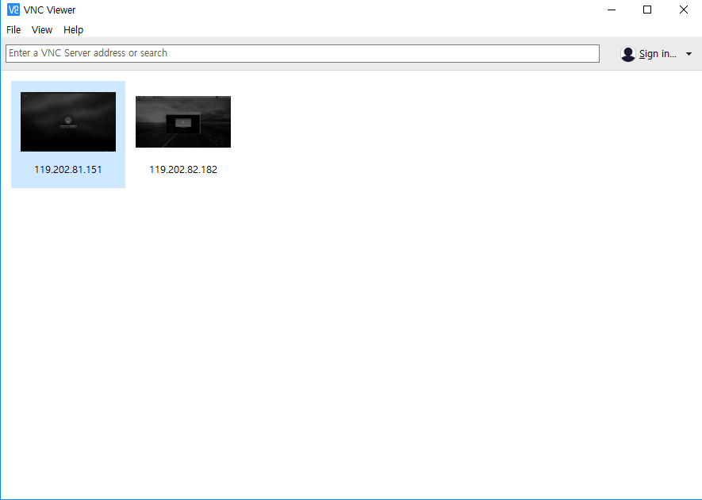

# Development_odroid - 20170629


리눅스 업데이트 및 기초 작업
________________________________________________


Odroid 초기 계정

Id: odroid

passwd: odroid


관리자 계정

Id: root

passwd: odroid


비밀번호를 바꾸는 법

​		`passwd`

를 입력하면 현재 접속한 계정의 비밀번호를 바꿀 수 있다.


관리자 계정의 비밀번호를 바꾸려면

​		`sudo passwd root`

를 통해서 관리자 계정으 비밀번호를 바꿀 수 있다.


HDMI 연결시 해상도 넘어가는 문제 발생

Control Center 실행 -> Monotior -> 해상도를 1680 X 1050으로 낮추면 1920X 1080 해상도에 대해 해결 가능


리눅스 커널 및 초기 업데이트


​	`sudo apt update`    		[~ 1min]

​	`sudo apt upgrade` 		[약 20min]

​	`sudo apt dist-upgrade`	[~ 10s or none ]

​	

패키지 업데이트

`sudo apt-get install update`

를 진행하였는데 Unable to locate package update error 발생

Software & Updates라는 프로그램을 실행하여 main 서버와 universe 서버등으로 부터 업데이트 시도... Fail

원인은 Check internet connection 에러 그러나 랜선은 꽂아놓은 상태이다.

`ping google.co.kr `

을 통해서 인터넷 연결을 확인하면 time = 30~40ms 으로 인터넷 랜선 연결은 되어있는 상태이다.


source.list 변경을 통한 해결 시도

`cd /etc/apt`

`sudo cp sources.list sources.list.bak`

`sudo nano sources.list`

의미가 없었음


update는 안되지만 install은 잘된다.

원격 연결을 위해서 x11vnc 설치

`sudo apt-get install x11vnc`

`x11vnc -storepasswd` 를 입력하면 접속 패스워드(odroid)를 설정한다.

`x11vnc -usepw`


기본 텍스트 편집기 vim 설치

`sudo apt-get install vim`


Odroid 계정 autologin 설정

`cd /usr/share/lightdm/lightdm.conf.d`

`sudo vim 60-lightdm-gtk-greeter.conf `

Vim editor를 이용해 아래와 같이 입력해주었다.


```
greeter-session = lightdm-gtk-greeter

autologin-user = odroid
```


`sudo reboot`를 통해 자동 접속 확인... 성공


x11vnc auto start 세팅

`sudo nano /lib/systemd/system/x11vnc.service`를 하면 빈 창이 뜬다.


```markdown
[Unit]
Description=Start x11vnc at startup.
After=multi-user.target

[Service]
Type=simple
ExecStart=/usr/bin/x11vnc -auth guess -forever -loop -noxdamage -repeat -rfbauth /home/odroid/.vnc/passwd -rfbport 5900 -shared

[Install]
WantedBy = multi-user.target
```


아래와 같이 입력하여 vnc를 재실행시켜준다.

```markdown
sudo systemctl daemon-reload
sudo systemctl enable x11vnc.service
sudo systemctl start x11vnc.service
```


g++ compile 테스트


```markdown
sudo mkdir test
cd test
sudo vim main.cpp
```


아래와 같이 기본적인 테스트 프로그램을 코딩했다.

```c++
#include<iostream>

using namespace std;

int main()
{
  cout<<"hello world!"<<endl;
  return 0;
}
```


`sudo g++ -o main main.cpp`를 입력하여 컴파일 해준다.

`sudo ./main` 을 실행시키면 hello world!가 출력된다.

확인 완료.


데스크탑 VNC viewer 설치

Realvnc 회사의 viewer를 설치하여 사용했다. 

다운로드를 하면 exe형태로 다운로드되어 실행하면 viewer가 실행된다.

원격연결한 odroid의 ip 주소를 입력하면 원격연결된다.

https://www.realvnc.com/download/viewer/


