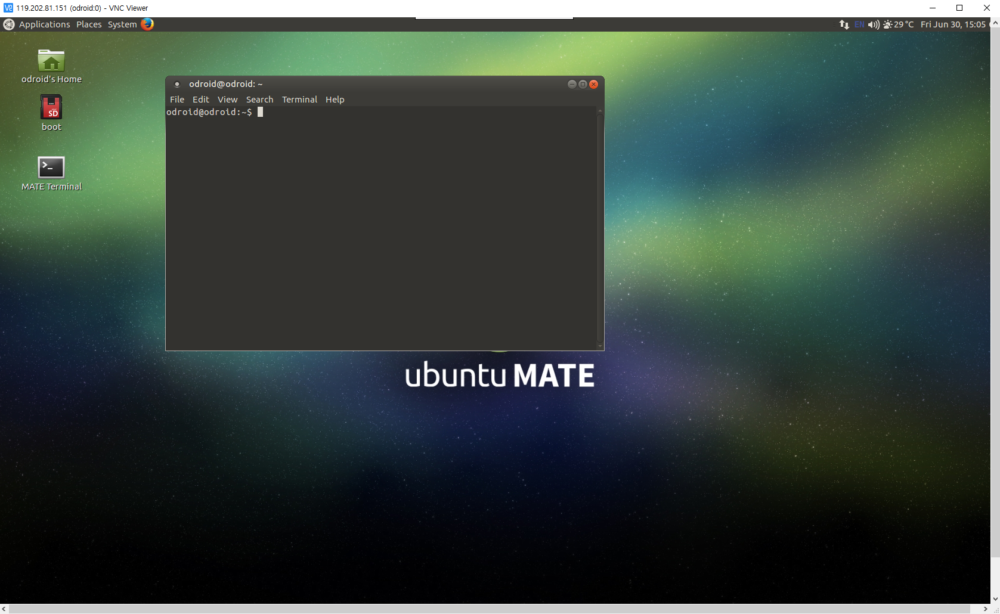
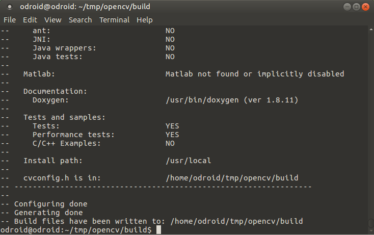

# Development_odroid - 20170630


##리눅스 패키지 설치 및 Opencv


odroid에 원격접속 했을 때의 사진이다.




`sudo apt-get install update`는 잘못된 명령어였다.

`sudo apt-get update`가 일반 패키지 업데이트 명령어로 다시 테스트해서 원인 에러를 다시 검색해봐야한다.


opencv 설치전 필요한 dependency library들을 설치한다.

```markdown
sudo apt-get install build-essential checkinstall cmake git pkg-config yasm libtiff5-dev libjpeg-dev libjasper-dev libavcodec-dev libavformat-dev libswscale-dev libdc1394-22-dev libxine2-dev libgstreamer0.10-dev libgstreamer-plugins-base0.10-dev libv4l-dev python-dev python-numpy libqt4-dev libgtk2.0-dev libmp3lame-dev libtheora-dev libvorbis-dev libxvidcore-dev x264 libvtk5-qt4-dev libqt4-opengl-dev libopenexr-dev python-tk libeigen3-dev libx264-dev libqtwebkit-dev doxygen
```


opencv 설치를 위한 폴더를 생성하였다.

```markdown
mkdir tmp
cd tmp
```


github로 부터 최신 opencv를 다운로드한다.

```
git clone https://github.com/Itseez/opencv.git
git clone https://github.com/Itseez/opencv_contrib.git
```


cmake를 진행할 build directory를 만든다.

```
cd opencv
mkdir build
cd build
```


cmake를 통해 makefile을 생성시킨다.

```
cmake -D CMAKE_BUILD_TYPE=RELEASE -D CMAKE_INSTALL_PREFIX=/usr/local -D  WITH_V4L=ON -D INSTALL_C_EXAMPLES=ON -D INSTALL_PYTHON_EXAMPLES=OFF -D BUILD_EXAMPLES=ON -D WITH_QT=ON -D WITH_TBB=ON -D WITH_OPENGL-ES=ON -D WITH_OPENGL=OFF -D WITH_OPENCL=ON -D WITH_OPENMP=ON -D ENABLE_NEON=ON -D OPENCV_ENABLE_NONFREE=ON -D OPENCV_EXTRA_MODULES_PATH=../../opencv_contrib/modules ../
```

다음과 같이 결과창이 출력된다.




install을 진행하기 전에 odroid의 cpu core 개수를 확인한다.

`cat /proc/cpuinfo | grep processor | wc -l`

결과로 8이 출력되었다.


`time sudo make -j6` 을 입력하여 opencv를 컴파일한다. 시간이 오래걸리게 된다.

time 명령어는 make에 걸리는 시간을 측정해준다.


`GST_VIDEO_FORMAT_ENCODED was not declared in this scope`

에러가 발생하였다

`-D WITH_GSTREAMER_0_10=ON`을 Cmake makefile 생성에 추가시켜서 다시 실행시켰다.

```
cmake -D CMAKE_BUILD_TYPE=RELEASE -D CMAKE_INSTALL_PREFIX=/usr/local -D  WITH_V4L=ON -D INSTALL_C_EXAMPLES=ON -D INSTALL_PYTHON_EXAMPLES=OFF -D BUILD_EXAMPLES=ON -D WITH_QT=ON -D WITH_TBB=ON -D WITH_OPENGL-ES=ON -D WITH_OPENGL=OFF -D WITH_OPENCL=ON -D WITH_OPENMP=ON -D ENABLE_NEON=ON -D OPENCV_ENABLE_NONFREE=ON -D WITH_GSTREAMER_0_10=ON -D OPENCV_EXTRA_MODULES_PATH=../../opencv_contrib/modules ../
```


이번엔 open_gl 쪽에서 문제가 발생하였다. 아마도 opengl을 설치하지 않은 상태라 그런것으로 추측하여 opengl의 설정을 바꿔주었다.

```
cmake -D CMAKE_BUILD_TYPE=RELEASE -D CMAKE_INSTALL_PREFIX=/usr/local -D  WITH_V4L=ON -D INSTALL_C_EXAMPLES=ON -D INSTALL_PYTHON_EXAMPLES=OFF -D BUILD_EXAMPLES=ON -D WITH_QT=ON -D WITH_TBB=ON -D WITH_OPENGL-ES=ON -D WITH_OPENGL=ON -D WITH_OPENCL=ON -D WITH_OPENMP=ON -D ENABLE_NEON=ON -D OPENCV_ENABLE_NONFREE=ON -D WITH_GSTREAMER_0_10=ON -D OPENCV_EXTRA_MODULES_PATH=../../opencv_contrib/modules ../
```

마지막으로 `sudo make install` 을 입력하여 opencv 설치를 마무리 한다. 