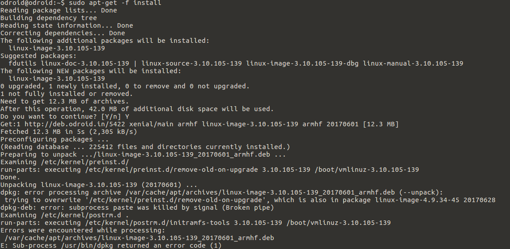

# Development_odroid - 20170630


##Opencv 설치 및 에러 해결


odroid에 원격 접속한 후 Caps Lock이 작동안하는 버그를 발견했다.


`sudo nano /lib/systemd/system/x11vnc.service`를 수정해준다.


Service ExecStart라인에 -capslock 옵션을 추가시켜준다.

```
[Unit]
Description=Start x11vnc at startup.
After=multi-user.target

[Service]
Type=simple
ExecStart=/usr/bin/x11vnc -auth guess -forever -loop -capslock -noxdamage -repeat -rfbauth /home/odroid/.vnc/passwd -rfbport 5900 -shared

[Install]
WantedBy = multi-user.target
```


성공적으로 해결되었다.


apt-get update error 문제 해결 시도

`sudo nano /etc/apt/sources.list`


```
deb http://ports.ubuntu.com/ubuntu-ports/ xenial main universe multiverse
deb http://ports.ubuntu.com/ubuntu-ports/ xenial-security main multiverse universe
```

위의 두줄을 제외한 나머지 줄은 모두 주석처리 했다.


아래 코드를 실행시켜준다. XU4 Xenial 16.04버전 용이다.

```
sudo wget http://deb.odroid.in/lists/5422-xenial.list -O /etc/apt/sources.list.d/odroid.list
sudo apt-key adv --keyserver keyserver.ubuntu.com --recv-keys AB19BAC9
```


`sudo apt-get update`가 문제없이 실행된다.


`sudo apt-get upgrade`를 진행하면서 

encounter error linux-image-xu3가 발생하였다,

Kernel 문제로 보여지며 이에 대한 자료를 조사하였다.

Linux Kernel 업데이트

```
git clone --depth 1 https://github.com/hardkernel/linux -b odroidxu4-4.9.y
cd linux
make odroidxu3_defconfig
make -j8
sudo make modules_install
sudo cp -f arch/arm/boot/zImage /media/boot
sudo cp -f arch/arm/boot/dts/exynos5422-odroidxu3.dtb /media/boot
sudo cp -f arch/arm/boot/dts/exynos5422-odroidxu4.dtb /media/boot
sudo cp -f arch/arm/boot/dts/exynos5422-odroidxu3-lite.dtb /media/boot
sudo reboot
```


```
sudo apt-get install -f
```

위 코드를 통해 문제를 해결하라고 한다.





trying overwrite를 시도하기 위해서 

```
sudo dpkg -i --force-overwrite /var/cache/apt/archives/linux-image-3.10.105-139_20170601_armhf.db
```

그러나 overwrite가 실패했고, 해결법으로 force-all을 시도하였다.

```
sudo dpkg -i --force-all /var/cache/apt/archives/linux-image-3.10.105-139_20170601_armhf.db
```

성공.

```
sudo apt-get -f install
```

를 다시 실행한결과 linux-image-4.9.27-35가 설치되었다. 


Text editor download

Geany라는 code editor를 발견했다.

Download는

```
sudo apt-get update
sudo apt-get install geany
```


command line에서의 실행은 아래 코드로 가능하다.

```
geany <file name>
```


테스트를 위해 이전에 만든 test 폴더로 가서 테스트해보면

```
cd test
geany main.cpp
```

아래 그림과 같이 실행된다.


compile 버튼을 누른 결과 아래와 같은 permission error가 발생한다.


```
sudo geany main.cpp
```

로 실행을 시키고 compile과 build를 실행시킨 결과 에러가 발생하지 않는다.

compile을 하면 .o 파일을 만들고 build를 하면 .o를 바탕으로 실행파일을 만든다.


geany에 있는 톱니바퀴 run버튼을 누르면 터미널이 새로 열리면서 실행이 된다. 