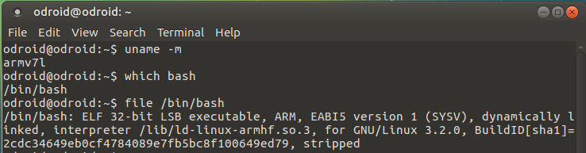
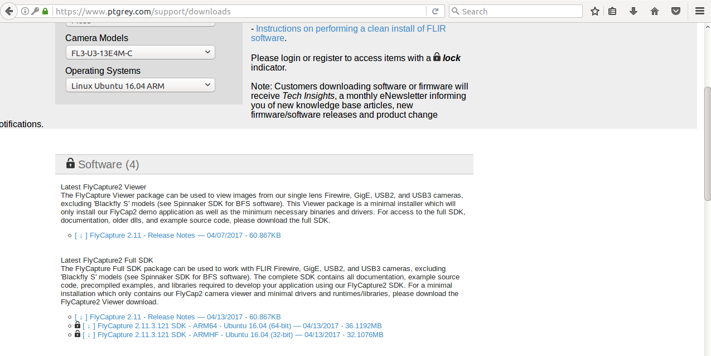

# Development_odroid - 20170628


## OPENCV compile & SDK


text editor geany install

    sudo apt-get install geany


test용 directory를 만든다.

    mkdir test
    cd test


github로부터 test용 image를 하나 다운로드한다.

    wget https://github.com/kysin960814/Development_odroid/raw/mster/Picture/20170628_SDset.jpg


    #include <iostream>
    #include <opencv2/opencv.hpp>
    #include <opencv2/highgui.hpp>
    
    using namespace std;
    using namespace cv;
    
    int main()
    {
      		Mat image;
      		namedWindow("Test",CV_WINDOW_AUTOSIZE);
      		image = imread("20170628_SDset.jpg",CV_LOAD_IMAGE_COLOR);
      
      		if(image.empty())
            {
            	cout<<"image is empty"<<endl;
              	return 0;
            }
      		imshow("Test",image);
      		waitKey(0);
      		destroyWindow("Test");
      
      		return 0;
    }


pkg-config setting

    cd tmp/opencv/build
    pkg-config --modversion opencv

3.2.0이 출력된다.

    cat /etc/ld.so.conf.d/*

를 실행하면 

    #Multiarch support
    /lib/arm-linux-gnueabihf
    /usr/lib/arm-linux-gnueabihf
    /usr/lib/arm-linux-gnueabihf/mali-egl
    /sur/lib/arm-linux-gnueabihf/mesa
    #lib default configuration
    /usr/local/lib

/usr/local/lib이 없으면 sudo echo '/usr/local/lib'> /etc/ld.so.conf.d/opencv.conf

있으면

sudo ldconfig


plg-config --libs --cflags opencv를 실행하면 아래 사진과 같이 출력되면 성공이다.


다시 테스트를 위해서

    cd 
    cd test
    g++ -o main main.cpp $(pkg-config --libs --cflags opencv)
    sudo ./main

아래 그림은 실행 결과이다.


Point grey setting

```
uname -m
```

armv7l로 표시된다. 더 자세한 확인을 위해서

```
which bash
file /bin/bash
```

를 실행시키면



위 그림과 같이 출력된다. Odroid xu4는 32 bit의 Arm인것을 확인할 수 있다.


dependency libraries 설치

```
sudo apt-get install libraw1394-11 libgtkmm-2.4-1v5 libglademm-2.4-1v5 libgtkglextmm-x11-1.2-dev libgtkglextmm-x11-1.2 libusb-1.0-0
```


Point grey fliycapture sdk 다운로드

로그인 해서 다운로드해야하므로 Odroid에 있는 파이어폭스를 실행시킨다.

https://www.ptgrey.com/support/downloads 를 입력하여 홈페이지에 접속한다.

로그인을 한후,


Flea3 

FL3-U3-13E4M-C

Linux Ubuntu 16.04 ARM

을 선택한다.


Software 중 Flycapture SDK ARMHF를 다운로드한다. 64bit면 Arm 64를 다운로드 한다.




다운로드 링크를 클릭한 후 save를 선택하고 OK를 누르면 다운로드가 시작된다.


