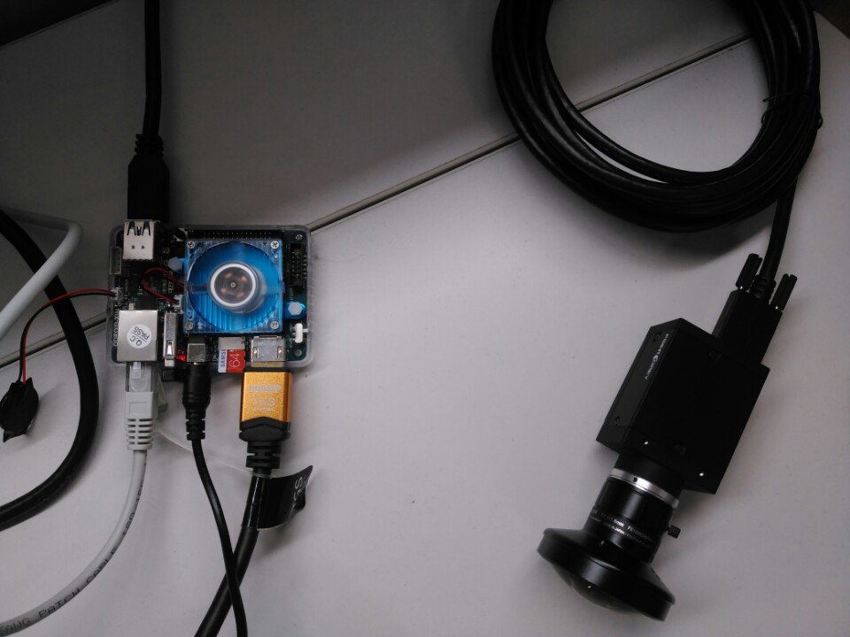
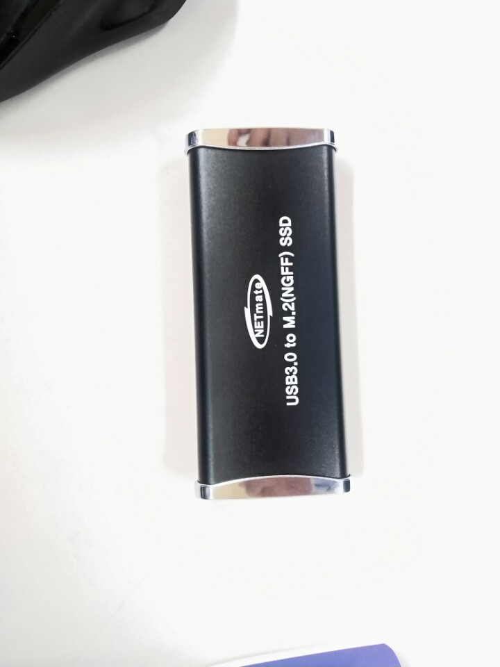
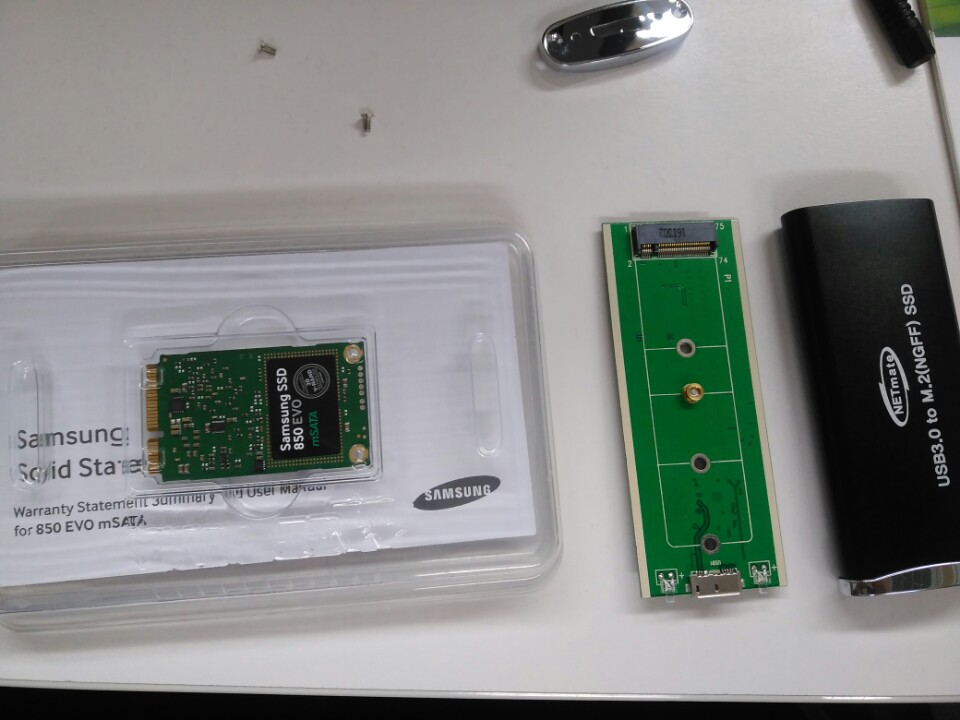

# Development_odroid - 20170705


## Hardware setting & unzip sdk

랩 자리에 오드로이드와 카메라 세팅을 다시했다.



Point Grey Camera를 USB 3.0포트에 연결하였다. 렌즈는 어안 렌즈를 장착했고, 조리개는 2로 열어놓았다.


ssd storage 점검을 하였다.



mSata ssd를 장착한 후 usb3.0으로 연결할 수 있게해주는 케이스이다.





삼성 250gb msata ssd와 case를 분해해서 내부 회로를 꺼내놓은 사진이다.

케이스 회로에 위에 ssd를 장착하면된다.

그러나 케이스와 ssd의 접착부의 길이가 달랐다.

케이스 인터페이스가 더 큰 것으로 다시 주문해야한다.


### Flycapture sdk unzip

지난번에 다운로드 받은 flycapture sdk 압축 파일을 압축 해제할 것이다.

```
cd Downloads
cp flycapture.2.11.3.121_armhf.tar.gz ~/test/flycapture.2.11.3.121_armhf.tar.gz
cd
cd test
tar xf flycapture.2.11.3.121_armhf.tar.gz
cd flycapture.2.11.3.121_armhf
```

위와 같은 명령어를 cmd에 입력해주면 아래 그림과 같이 파일들이 압축 해제된다.

