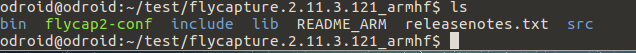
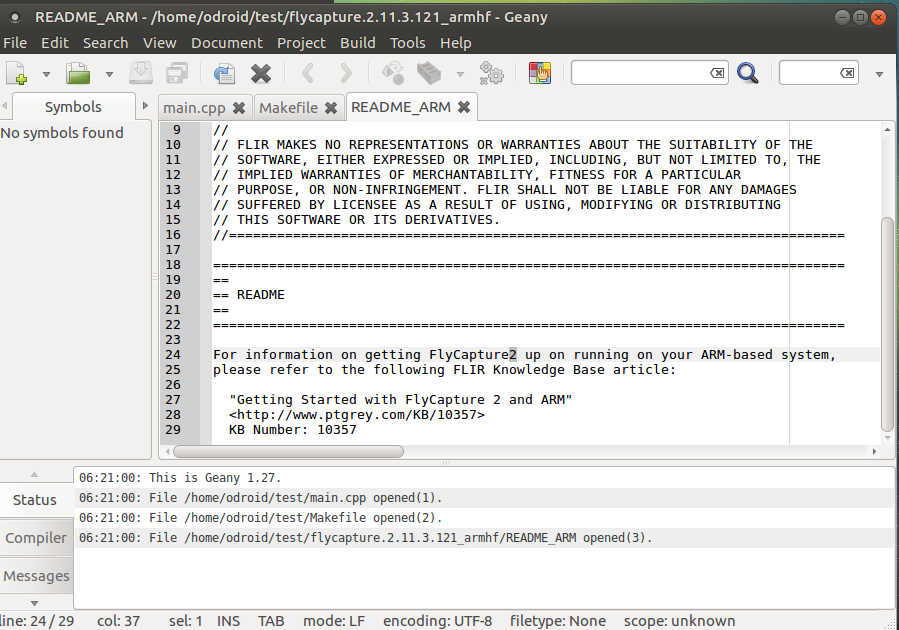
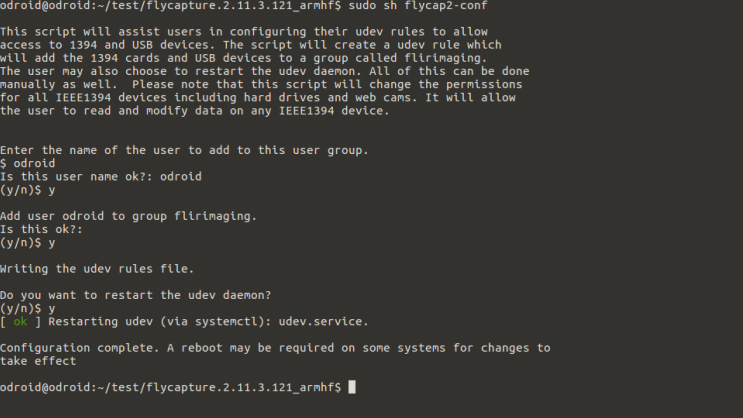
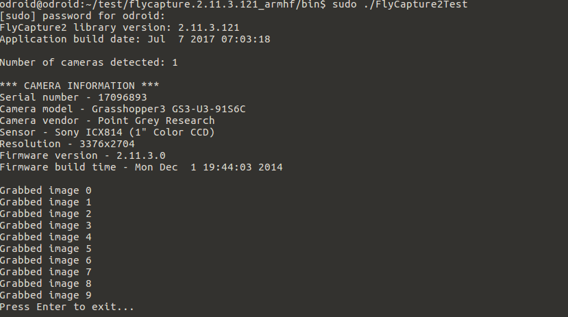
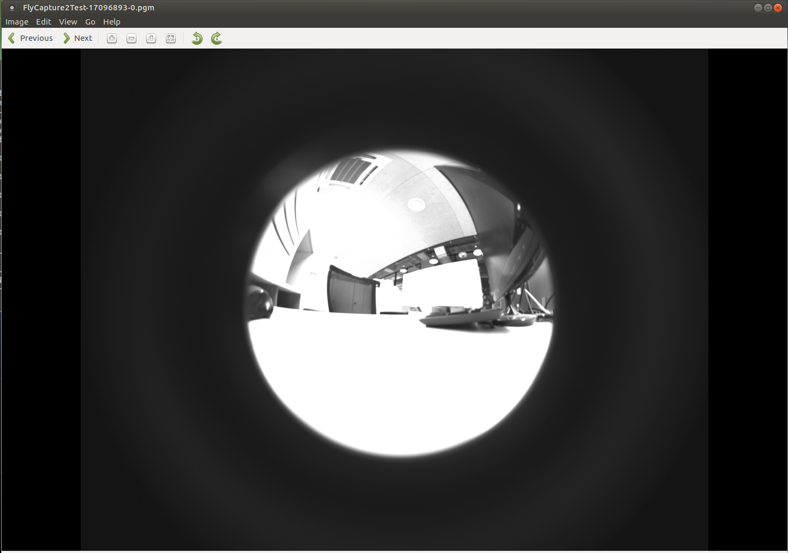

# Development_odroid - 20170707


## Install flycapture sdk & test

지난번에 압축 파일을 압축 해제하여 설치 준비를 했다.



`geany README_ARM`을 열어보면



위 사진과 같은 내용이 있다.

http://www.ptgrey.com/KB/10357 링크로 들어가서 설치를 한다.


libraray들을 /usr/lib 경로로 복사한다.

```
cd
cd test/flycapture.2.11.3.121_armhf/lib
sudo cp libflycapture* /usr/lib
cd ..
sudo sh flycap2-conf
```




```
sudo reboot
```

위의 과정을 통해서 sdk를 설치할 수 있다.


예제를 실행시켜서 실제로 프로그램이 작동하는지 확인해본다.

```
cd src
cd Flycapture2Test
make
cd ../..
cd bin
sudo ./FlyCapture2Test
```

를 실행하였다.

isochromous stream을 시작할 수 없다는 에러가 발생한다.

이 에러는 이미지 카메라 램이 부족하여 발생하는 것으로 먼저

```
cat /sys/module/usbcore/parameters/usbfs_memory_mb
```

를 명령창에 입력해준다. 결과값으로 16이 나오는데 메모리가 16mb만큼 카메라에 할당되어있다는 것이다.

이미지 크기가 큰 고화질 카메라가 메모리가 부족한 문제로

```
sudo sh -c 'echo 1000 > /sys/module/usbcore/parameters/usbfs_memory_mb'
```

를 해주고 cat으로 다시 확인해주면 1000으로 값이 바뀐다.


그후 다시 `sudo ./FlayCapture2Test`를 실행시켜주면 9장의 이미지를 찍는다.

사진 파일은 bin 폴더 내부에 생성된다. 




FlyCapture2Test-17096893-0.pgm이라는 사진파일을 연다.

```
eom FlyCapture2Test-17096893-0.pgm
```



Example로 실행한것이다 보니 Mono tone으로 찍혀있다. 

OpenCV와 연동한다면 컬러로 찍을 수 있을 것이다. 