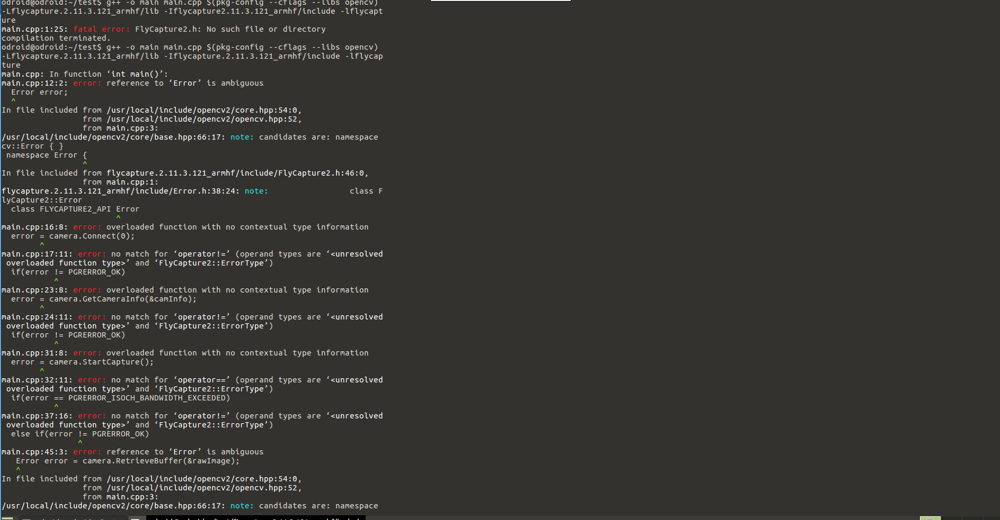
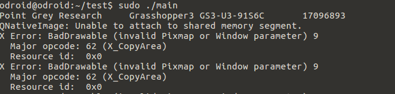

# Development_odroid - 201707010


## OpenCV with FlyCapture SDK


Opencv 설치와 SDK 모두 끝났다.

둘을 이용한 예제를 만들어 테스트해본다.

```
cd test
sudo geany main.cpp
```


구글 검색을 통해서 간단한 예제 파일을 찾았다.

```c++
#include "FlyCapture2.h"
#include <opencv2/opencv.hpp>
#include <opencv2/highgui.hpp>
#include <iostream>

using namespace FlyCapture2;
using namespace cv;
using namespace std;

int main()
{
    Error error;
    Camera camera;
    CameraInfo camInfo;

    // Connect the camera
    error = camera.Connect( 0 );
    if ( error != PGRERROR_OK )
    {
        std::cout << "Failed to connect to camera" << std::endl;     
        return false;
    }

    // Get the camera info and print it out
    error = camera.GetCameraInfo( &camInfo );
    if ( error != PGRERROR_OK )
    {
        std::cout << "Failed to get camera info from camera" << std::endl;     
        return false;
    }
    std::cout << camInfo.vendorName << "\t"<< camInfo.modelName << "\t"<<
      camInfo.serialNumber << std::endl;
	
    error = camera.StartCapture();
    if ( error == PGRERROR_ISOCH_BANDWIDTH_EXCEEDED )
    {
        std::cout << "Bandwidth exceeded" << std::endl;     
        return false;
    }
    else if ( error != PGRERROR_OK )
    {
        std::cout << "Failed to start image capture" << std::endl;     
        return false;
    } 

    // capture loop
    char key = 0;
    while(key != 'q')
    {
        // Get the image
        Image rawImage;
        Error error = camera.RetrieveBuffer( &rawImage );
        if ( error != PGRERROR_OK )
        {
                std::cout << "capture error" << std::endl;
                continue;
        }

        // convert to rgb
        Image rgbImage;
        rawImage.Convert( FlyCapture2::PIXEL_FORMAT_BGR, &rgbImage );

        // convert to OpenCV Mat
        unsigned int rowBytes = (double)rgbImage.GetReceivedDataSize()/(double)rgbImage.GetRows();       
        cv::Mat image = cv::Mat(rgbImage.GetRows(), rgbImage.GetCols(), CV_8UC3, rgbImage.GetData(),rowBytes);

        cv::imshow("image", image);
        key = cv::waitKey(30);        
    }

    error = camera.StopCapture();
    if ( error != PGRERROR_OK )
    {
        // This may fail when the camera was removed, so don't show 
        // an error message
    }  

    camera.Disconnect();

    return 0;
}
```

코드를 해석해보면 카메라 연결을 하고 rawImage를 받은 후 rgbImage로 바꾼다.

rgbImage를 OpenCV의 Mat 파일로 바꾼 후 show하는게 전부인 코드이다.


```
g++ -o main main.cpp $(pkg-config --cflags --libs opencv) -L~/test/flycapture.2.11.3.121_armhf/lib -lflycapture
```

fatal eror: FlyCaputr2.h: No such file or directory라는 에러가 발생했다.

헤더파일을 차지 못한 것이기 때문에 -

```
g++ -o main main.cpp $(pkg-config --cflags --libs opencv) -L~/test/flycapture.2.11.3.121_armhf/lib -I~/test/flycapture.2.11.3.121_armhf/include -lflycapture
```

그 결과 수많은 에러가 발생했다.




먼저 가장 중요한 에러로 Error라는 클레스가 OPENCV와 Flycapture2에서 동시에 쓰인다는 것이다. 이에 대한 해결책을 마련해야했다. 

앞으로 이미지 변환후에는 Opencv를 많이 쓸것이므로 FlayCapture2의 네임스페이스를 빼기로 했다.

```c++
#include <FlyCapture2.h>
#include <opencv2/opencv.hpp>
#include <opencv2/highgui.hpp>
#include <iostream>

using namespace cv;
using namespace std;

int main()
{
    FlyCapture2::Error error;
    FlyCapture2::Camera camera;
    FlyCapture2::CameraInfo camInfo;

    // Connect the camera
    error = camera.Connect( 0 );
    if ( error != FlyCapture2::PGRERROR_OK )
    {
        cout << "Failed to connect to camera" << endl;     
        return 0;
    }

    // Get the camera info and print it out
    error = camera.GetCameraInfo( &camInfo );
    if ( error != FlyCapture2::PGRERROR_OK )
    {
        cout << "Failed to get camera info from camera" << endl;     
        return 0;
    }
    cout << camInfo.vendorName << "\t"<< camInfo.modelName << "\t"<<
      camInfo.serialNumber << endl;
	
    error = camera.StartCapture();
    if ( error == FlyCapture2::PGRERROR_ISOCH_BANDWIDTH_EXCEEDED )
    {
        std::cout << "Bandwidth exceeded" << std::endl;     
        return 0;
    }
    else if ( error != FlyCapture2::PGRERROR_OK )
    {
        cout << "Failed to start image capture" << endl;     
        return 0;
    } 

    // capture loop
    char key = 0;
    while(key != 'q')
    {
        // Get the image
        FlyCapture2::Image rawImage;
        FlyCapture2::Error error = camera.RetrieveBuffer( &rawImage );
        if ( error != FlyCapture2::PGRERROR_OK )
        {
                cout << "capture error" << endl;
                continue;
        }

        // convert to rgb
        FlyCapture2::Image rgbImage;
        rawImage.Convert( FlyCapture2::PIXEL_FORMAT_BGR, &rgbImage );

        // convert to OpenCV Mat
        unsigned int rowBytes = (double)rgbImage.GetReceivedDataSize()/(double)rgbImage.GetRows();       
        Mat image = Mat(rgbImage.GetRows(), rgbImage.GetCols(), CV_8UC3, rgbImage.GetData(),rowBytes);

        imshow("image", image);
        key = waitKey(30);        
    }

    error = camera.StopCapture();
    if ( error != FlyCapture2::PGRERROR_OK )
    {
        // This may fail when the camera was removed, so don't show 
        // an error message
    }  

    camera.Disconnect();

    return 0;
}
```

g++을 이용해서 컴파일을 하면  main excutable이 나온다.

```
sudo ./main
```


일단 성공했으나 이미지의 크기를 리사이즈 안해서 화면을 넘치게 했다.  아래 에러도 리사이징을 시키면 해결될 것으로 보인다.




