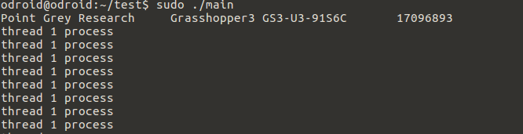

# Development_odroid - 20170725


## Multi threading


thread를 도입하기 앞서서 미리 코딩해둔 main파일을 camtest란 파일로 복사해둔다.

```
cp main.cpp camtest.cpp
vim Makefile
```

SRC에 camtest.cpp를 추가해주고 camtest 항목을 만든다.

```
SRC = main.cpp camtest.cpp
// 중략
camtest: camtest.cpp
	$Q echo [link]
	$Q $(CC) -o $@ camtest.cpp $(CFLAGS) $(LDFLAGS)
```


 멀티 쓰레딩에 사용되는 라이브러리는 여러개 있다. 그 중 리눅스 시스템에서 쓰이는 pthread라는 POSIX Thread 라이브러리를 사용할 것이다. 이 라이브러리는 따로 설치할 필요 없이 기본적으로 리눅스에 설치되어 있다. 

프로그램의 구조는 main에서 영상을 받고 받은 영상을 쓰레드에서 처리하는 방법을 사용한다. 


```c++
#include <FlyCapture2.h>
#include <iostream>
#include <pthread.h>

#include <opencv2/opencv.hpp>
#include <opencv2/highgui.hpp>

using namespace cv;
using namespace std;

#define NUM_THREADS 2
#define ORIGIN_HEIGHT 2704
#define ORIGIN_WIDTH 3376

void *Thread1(void *arg)
{
	Mat resized_img;
	cout<<"thread 1 process"<<endl;
  	pthread_exit(NULL);
}

int main()
{
	FlyCapture2::Error error;
    FlyCapture2::Camera camera;
    FlyCapture2::CameraInfo camInfo;

    // Connect the camera
    error = camera.Connect( 0 );
    if ( error != FlyCapture2::PGRERROR_OK )
    {
        cout << "Failed to connect to camera" << endl;     
        return 0;
    }

    // Get the camera info and print it out
    error = camera.GetCameraInfo( &camInfo );
    if ( error != FlyCapture2::PGRERROR_OK )
    {
        cout << "Failed to get camera info from camera" << endl;     
        return 0;
    }
    cout << camInfo.vendorName << "\t"<< camInfo.modelName << "\t"<<
      camInfo.serialNumber << endl;
	FlyCapture2::FC2Config config;
  
  	//buffer number setting
   	error = camera.GetConfiguration(&config);
  	if(error != FlyCapture2::PGRERROR_OK)
    {
    	cout<<"Failed to get configuration"<<endl;
      	return 0;
    }
  	config.numBuffers = 1;
  	error = camera.SetConfiguration(&config);
  	if(error!= FlyCapture2::PGRERROR_OK)
    {
    	cout<<"Failed to set configuration"<<endl;
      	return 0;
    }
  
  	//shutter speed
   	FlyCapture2::Property prop;
	prop.type = FlyCapture2::SHUTTER;
	prop.onOff = true;
	prop.autoManualMode = false;
	prop.absControl = true;
	prop.absValue = 20;
	error = camera.SetProperty(&prop);
  	
  	//gain setting
  	prop.type = FlyCapture2::GAIN;
	prop.onOff = true;
	prop.autoManualMode = false;
	prop.absControl = true;
	prop.absValue = 0;
	error = camera.SetProperty(&prop);
  
  	//exposure setting
  	prop.type = FlyCapture2::AUTO_EXPOSURE;
	prop.onOff = true;
	prop.autoManualMode = false;
	prop.absControl = true;
	prop.absValue = 3.5;
	error = camera.SetProperty(&prop);
  	
  	//start capture
    error = camera.StartCapture();
    if ( error == FlyCapture2::PGRERROR_ISOCH_BANDWIDTH_EXCEEDED )
    {
        std::cout << "Bandwidth exceeded" << std::endl;     
        return 0;
    }
    else if ( error != FlyCapture2::PGRERROR_OK )
    {
        cout << "Failed to start image capture" << endl;     
        return 0;
    } 

  	pthread_t threads[NUM_THREADS];
  	int rc;
  
    // capture loop
    char key = 0;
    while(key != 'q')
    {
        // Get the image
        FlyCapture2::Image rawImage;
        FlyCapture2::Error error = camera.RetrieveBuffer( &rawImage );
        if ( error != FlyCapture2::PGRERROR_OK )
        {
                //cout << "capture error" << endl;
                continue;
        }

        // convert to rgb
        FlyCapture2::Image rgbImage;
        rawImage.Convert( FlyCapture2::PIXEL_FORMAT_BGR, &rgbImage );

        // convert to OpenCV Mat
        unsigned int rowBytes = (double)rgbImage.GetReceivedDataSize()/(double)rgbImage.GetRows();       
        Mat image = Mat(rgbImage.GetRows(), rgbImage.GetCols(), CV_8UC3, rgbImage.GetData(),rowBytes);
	
      	rc = pthread_create(&threads[0],NULL,Thread1,(void *)image.data);
      	int(rc)
        {
        	cout<<"Unable to create thread,"<<rc<<endl;
          	exit(-1);
        }
        Mat rimage;
        resize(image,rimage,Size(480,320));
       
        imshow("image", rimage);
        key = waitKey(30);        
    }

    error = camera.StopCapture();
    if ( error != FlyCapture2::PGRERROR_OK )
    {
    }  

    camera.Disconnect();

    return 0;   
}

```

위와 같이 코드를 짜면 영상을 받을 때마다 쓰레드가 실행된다. 쓰레드 실행 결과로 thread 1 process 가 실행된다.




 이렇게 이미지를 받을 때마다 쓰레드를 생성시켜서 하는 방법은 imshow를 쓰레드에 추가시키면 실행이 되지 않았다. 그렇기에 쓰레드 1을 무한 루프로 유지시키면서 캡쳐한 이미지를 공유 자원으로 갱신 시키는 방법으로 코드를 다시 짜야한다.

무한 루프를 통해서도 쓰레드에서의 imshow는 실행되지 않았다.  그래서 두개의 큐를 사용해서 쓰레드 간의 데이터 교환을 하는 구조로 프로그래밍을 시도하였다. 


```c++
#include <FlyCapture2.h>
#include <iostream>
#include <queue>
#include <pthread.h>

#include <opencv2/opencv.hpp>
#include <opencv2/highgui.hpp>

using namespace cv;
using namespace std;

#define NUM_THREADS 2
#define ORIGIN_HEIGHT 2704
#define ORIGIN_WIDTH 3376

bool thread_onOff = 1;
queue<Mat> frame;
queue<Mat> result;

void *Thread1(void *arg)
{
	while(thread_onOff)
    {
    	if(frame.size()>=1)
        {
        	Mat resized_img;
          	Mat cap=frame.front.clone();
          	resize(cap,resized_img,Size(640,480));
          	cout<<"thread 1 process"<<endl;
          	result.push(resized_img.clone());
          	frame.pop();
        }  
    }
  	pthread_exit(NULL);
}

int main()
{
	FlyCapture2::Error error;
    FlyCapture2::Camera camera;
    FlyCapture2::CameraInfo camInfo;

    // Connect the camera
    error = camera.Connect( 0 );
    if ( error != FlyCapture2::PGRERROR_OK )
    {
        cout << "Failed to connect to camera" << endl;     
        return 0;
    }

    // Get the camera info and print it out
    error = camera.GetCameraInfo( &camInfo );
    if ( error != FlyCapture2::PGRERROR_OK )
    {
        cout << "Failed to get camera info from camera" << endl;     
        return 0;
    }
    cout << camInfo.vendorName << "\t"<< camInfo.modelName << "\t"<<
      camInfo.serialNumber << endl;
	FlyCapture2::FC2Config config;
  
  	//buffer number setting
   	error = camera.GetConfiguration(&config);
  	if(error != FlyCapture2::PGRERROR_OK)
    {
    	cout<<"Failed to get configuration"<<endl;
      	return 0;
    }
  	config.numBuffers = 1;
  	error = camera.SetConfiguration(&config);
  	if(error!= FlyCapture2::PGRERROR_OK)
    {
    	cout<<"Failed to set configuration"<<endl;
      	return 0;
    }
  
  	//shutter speed
   	FlyCapture2::Property prop;
	prop.type = FlyCapture2::SHUTTER;
	prop.onOff = true;
	prop.autoManualMode = false;
	prop.absControl = true;
	prop.absValue = 20;
	error = camera.SetProperty(&prop);
  	
  	//gain setting
  	prop.type = FlyCapture2::GAIN;
	prop.onOff = true;
	prop.autoManualMode = false;
	prop.absControl = true;
	prop.absValue = 0;
	error = camera.SetProperty(&prop);
  
  	//exposure setting
  	prop.type = FlyCapture2::AUTO_EXPOSURE;
	prop.onOff = true;
	prop.autoManualMode = false;
	prop.absControl = true;
	prop.absValue = 3.5;
	error = camera.SetProperty(&prop);
  	
  	//start capture
    error = camera.StartCapture();
    if ( error == FlyCapture2::PGRERROR_ISOCH_BANDWIDTH_EXCEEDED )
    {
        std::cout << "Bandwidth exceeded" << std::endl;     
        return 0;
    }
    else if ( error != FlyCapture2::PGRERROR_OK )
    {
        cout << "Failed to start image capture" << endl;     
        return 0;
    } 

  	pthread_t threads[NUM_THREADS];
  	int rc;
  	rc = pthread_create(&threads[0],NULL,Thread1,NULL);
  	if(rc)
     {
       cout<<"Error:unable to create thread,"<<rc<<endl;
     }
    // capture loop
    char key = 0;
    while(key != 'q')
    {
      	if(result.size()>=1)
        {
        	Mat tresult = result.front().clone();
          	result.pop();
          	if(!tresult.empty())
            {
            	imshow("Result",tresult);    
            }
        }
        // Get the image
        FlyCapture2::Image rawImage;
        FlyCapture2::Error error = camera.RetrieveBuffer( &rawImage );
        if ( error != FlyCapture2::PGRERROR_OK )
        {
                //cout << "capture error" << endl;
                continue;
        }

        // convert to rgb
        FlyCapture2::Image rgbImage;
        rawImage.Convert( FlyCapture2::PIXEL_FORMAT_BGR, &rgbImage );

        // convert to OpenCV Mat
        unsigned int rowBytes = (double)rgbImage.GetReceivedDataSize()/(double)rgbImage.GetRows();       
        Mat image = Mat(rgbImage.GetRows(), rgbImage.GetCols(), CV_8UC3, rgbImage.GetData(),rowBytes);
	
      	frame.push(image.clone());
      	cout<<frame.size()<<endl;
        key = waitKey(30);        
    }

    error = camera.StopCapture();
    if ( error != FlyCapture2::PGRERROR_OK )
    {
    }  
	
  	cout<<"Try to thread cancel"<<endl;
  	thread_onOff=0;
  	int status;
  	int ret=0;
  	ret = pthread_join(threads[0],(void**)&status);
  	if(ret == 0 )
      	cout<< "Thread shutdown success"<<status<<endl;
    else
      	cout<<"Thread shutdown error" << ret <<endl;
    camera.Disconnect();

    return 0;   
}
```

이렇게 코드를 짜서 쓰레드에 리사이징을 하고 리사이징 된 이미지를 메인에서 출력하는 형태로 테스트 코드를 코딩했다. 그러나 gdb를 이용한 디버그를 진행하면 일정 시간 이후에 확률적으로 메모리 카피 에러라면서 clone이나 copyto에 문제가 발생하는 것으로 보인다. mutex를 이용한 방법을 고안해야 할 것 같다. 