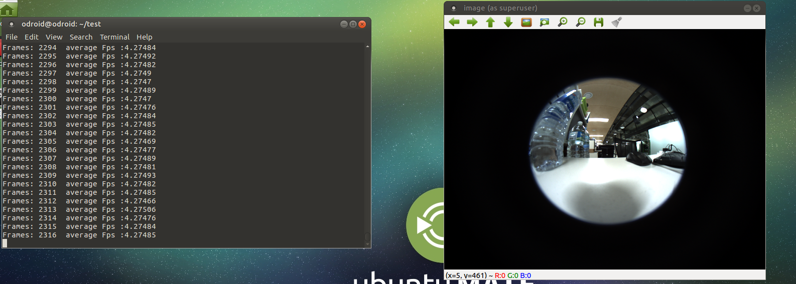

# Development_odroid - 201707027


## Multi threading


```c++
#include <FlyCapture2.h>
#include <iostream>
#include <pthread.h>

#include <opencv2/opencv.hpp>
#include <opencv2/highgui.hpp>

#include <sys/time.h>

using namespace cv;
using namespace std;

#define NUM_THREADS 2
#define ORIGIN_HEIGHT 2704
#define ORIGIN_WIDTH 3376

bool thread_onOff = 1;
Mat frame; // capture
pthread_mutex_t framelock;

FlyCapture2::Camera camera;

void *Thread1(void *arg)
{
 	FlyCapture2::Error error; 
 	//start capture
    error = camera.StartCapture();
    if ( error == FlyCapture2::PGRERROR_ISOCH_BANDWIDTH_EXCEEDED )
    {
        std::cout << "Bandwidth exceeded" << std::endl;     
       	pthread_exit(NULL);
    }
    else if ( error != FlyCapture2::PGRERROR_OK )
    {
        cout << "Failed to start image capture" << endl;     
        pthread_exit(NULL);
    } 
  
	while(thread_onOff)
    {
    	// Get the image
        FlyCapture2::Image rawImage;
        FlyCapture2::Error error = camera.RetrieveBuffer( &rawImage );
        if ( error != FlyCapture2::PGRERROR_OK )
        {
                //cout << "capture error" << endl;
                continue;
        }

        // convert to rgb
        FlyCapture2::Image rgbImage;
        rawImage.Convert( FlyCapture2::PIXEL_FORMAT_BGR, &rgbImage );

        // convert to OpenCV Mat
        unsigned int rowBytes = (double)rgbImage.GetReceivedDataSize()/(double)rgbImage.GetRows();       
        Mat image = Mat(rgbImage.GetRows(), rgbImage.GetCols(), CV_8UC3, rgbImage.GetData(),rowBytes);
      
      	pthread_mutex_lock(&framelock);
      	frame = image.clone();
      	pthread_mutex_unlock(&framelock);
    }
  	pthread_exit(NULL);
}

int main()
{
	FlyCapture2::Error error; 
    FlyCapture2::CameraInfo camInfo;

    // Connect the camera
    error = camera.Connect( 0 );
    if ( error != FlyCapture2::PGRERROR_OK )
    {
        cout << "Failed to connect to camera" << endl;     
        return 0;
    }

    // Get the camera info and print it out
    error = camera.GetCameraInfo( &camInfo );
    if ( error != FlyCapture2::PGRERROR_OK )
    {
        cout << "Failed to get camera info from camera" << endl;     
        return 0;
    }
    cout << camInfo.vendorName << "\t"<< camInfo.modelName << "\t"<<
      camInfo.serialNumber << endl;
	FlyCapture2::FC2Config config;
  
  	//buffer number setting
   	error = camera.GetConfiguration(&config);
  	if(error != FlyCapture2::PGRERROR_OK)
    {
    	cout<<"Failed to get configuration"<<endl;
      	return 0;
    }
  	config.numBuffers = 1;
  	error = camera.SetConfiguration(&config);
  	if(error!= FlyCapture2::PGRERROR_OK)
    {
    	cout<<"Failed to set configuration"<<endl;
      	return 0;
    }
  
  	//shutter speed
   	FlyCapture2::Property prop;
	prop.type = FlyCapture2::SHUTTER;
	prop.onOff = true;
	prop.autoManualMode = false;
	prop.absControl = true;
	prop.absValue = 20;
	error = camera.SetProperty(&prop);
  	
  	//gain setting
  	prop.type = FlyCapture2::GAIN;
	prop.onOff = true;
	prop.autoManualMode = false;
	prop.absControl = true;
	prop.absValue = 0;
	error = camera.SetProperty(&prop);
  
  	//exposure setting
  	prop.type = FlyCapture2::AUTO_EXPOSURE;
	prop.onOff = true;
	prop.autoManualMode = false;
	prop.absControl = true;
	prop.absValue = 3.5;
	error = camera.SetProperty(&prop);
  	
  	pthread_mutex_init(&framelock,NULL);
  
  	pthread_t threads[NUM_THREADS];
  	int rc;
  	rc = pthread_create(&threads[0],NULL,Thread1,NULL);
  
  if(rc)
     {
       cout<<"Error:unable to create thread,"<<rc<<endl;
     }
  	//timer
  
  	struct timeval start,end;
  	int n = 0;
  	double afps = 0;
  
    // capture loop
    char key = 0;
    while(key != 'q')
    {
      	gettimeofday(&start,NULL);
      	
		Mat temp;
      	pthread_mutex_lock(&framelock);
      	temp = frame.clone();
      	pthread_mutex_unlock(&framelock);
      	if(!temp.empty())
        {
          	Mat rimage;
          	resize(temp,rimage,Size(640,480));
          	imshow("image",rimage);
        }
      	else
        {
          	continue;
        }
      	
      	gettimeofday(&end,NULL);
      	double second = (end.tv_sec-start.tv_sec) + (end.tv_usec - start.tv_usec)/1000000.0
        n++;
      	afps = (afps*(n-1)+1/second)/n;
      	cout<< "Frames : "<<n<<"  average Fps: " << afps << endl;
        key = waitKey(30);        
    }

    error = camera.StopCapture();
    if ( error != FlyCapture2::PGRERROR_OK )
    {
    }  
	
  	cout<<"Try to thread cancel"<<endl;
  	thread_onOff=0;
  	int status;
  	int ret=0;
  	ret = pthread_join(threads[0],(void**)&status);
  	if(ret == 0 )
      	cout<< "Thread shutdown success"<<status<<endl;
    else
      	cout<<"Thread shutdown error" << ret <<endl;
    camera.Disconnect();

    return 0;   
}
```

이와 같이 쓰레드에서 영상을 갱신하고 메인 루프에서 영상 처리 알고리즘을 작동시키는 구조로 코드를 만들었다.




평균 프래임은 4.27으로 지난번 코드의 프레임인 3.2보다 속도가 상승했다. 그래도 쓰레드 없이 진행한 프레임인 7.2프레임보다는 속도가 느리다. 이는 안정성을 위해서 clone을 통한 딥 카피를 진행할 때 영상 크기가 크면서 시간이 걸리는 것으로 추측해볼 수 있다. 


쓰레드와 메인에서 clone을 빼고 = 연산자를 통해서 접근을 하면 Permission denied가 나오면서 Segment fault가 발생한다. 