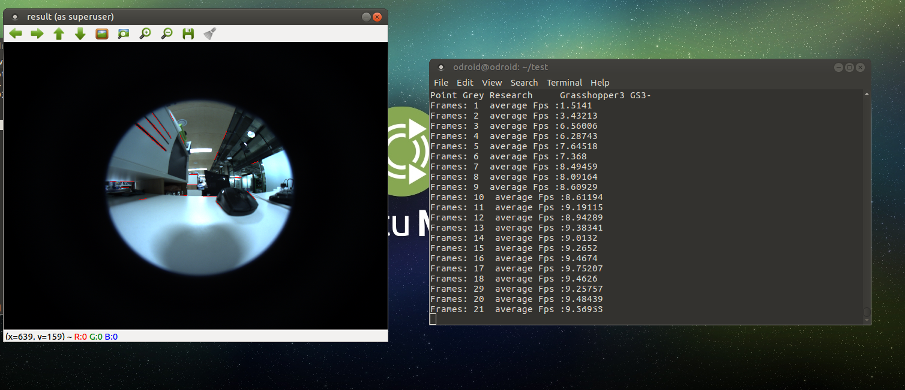
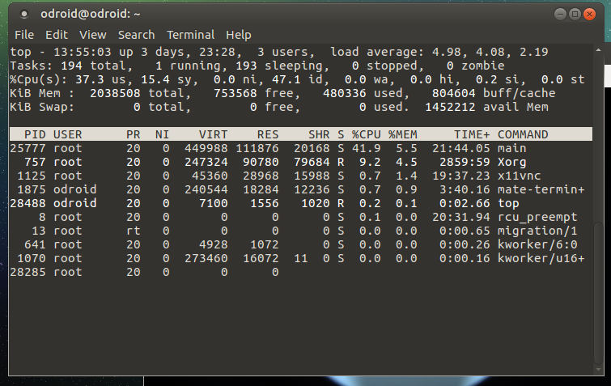

# Development_odroid - 20170801


## Multi Threading


 연산 속도를 증가시키기 위해서 main에서 frame을 받는 방법을 일반 copy로 바꾸어주었다. 영상 처리 테스트를 위해 Hough Line Detection Proability algorithm을 실행시키도록 했다. 그리고 TCP/IP 통신을 진행할 서브 쓰레드를 예비로 하나 더 만들었다. 

```c++
#include <FlyCapture2.h>
#include <iostream>
#include <pthread.h>

#include <opencv2/opencv.hpp>
#include <opencv2/highgui.hpp>

#include <sys/time.h>

using namespace cv;
using namespace std;

#define NUM_THREADS 2
#define ORIGIN_HEIGHT 2704
#define ORIGIN_WIDTH 3376
#define PI 3.141592

bool thread_onOff = 1;
Mat frame; // capture
pthread_mutex_t framelock;

FlyCapture2::Camera camera;

void *Thread1(void *arg)
{
 	FlyCapture2::Error error; 
 	//start capture
    error = camera.StartCapture();
    if ( error == FlyCapture2::PGRERROR_ISOCH_BANDWIDTH_EXCEEDED )
    {
        std::cout << "Bandwidth exceeded" << std::endl;     
       	pthread_exit(NULL);
    }
    else if ( error != FlyCapture2::PGRERROR_OK )
    {
        cout << "Failed to start image capture" << endl;     
        pthread_exit(NULL);
    } 
  
	while(thread_onOff)
    {
    	// Get the image
        FlyCapture2::Image rawImage;
        FlyCapture2::Error error = camera.RetrieveBuffer( &rawImage );
        if ( error != FlyCapture2::PGRERROR_OK )
        {
                //cout << "capture error" << endl;
                continue;
        }

        // convert to rgb
        FlyCapture2::Image rgbImage;
        rawImage.Convert( FlyCapture2::PIXEL_FORMAT_BGR, &rgbImage );

        // convert to OpenCV Mat
        unsigned int rowBytes = (double)rgbImage.GetReceivedDataSize()/(double)rgbImage.GetRows();       
        Mat image = Mat(rgbImage.GetRows(), rgbImage.GetCols(), CV_8UC3, rgbImage.GetData(),rowBytes);
      
      	pthread_mutex_lock(&framelock);
      	frame = image.clone();
      	pthread_mutex_unlock(&framelock);
    }
  	pthread_exit(NULL);
}

void *Thread2(void* arg)
{
  	while(thread_onOff)
    {
      	int i = 0;
        i++;
    }
    cout << "Thread 2 end" << endl;
  	pthread_exit(NULL);
}

int main()
{
	FlyCapture2::Error error; 
    FlyCapture2::CameraInfo camInfo;

    // Connect the camera
    error = camera.Connect( 0 );
    if ( error != FlyCapture2::PGRERROR_OK )
    {
        cout << "Failed to connect to camera" << endl;     
        return 0;
    }

    // Get the camera info and print it out
    error = camera.GetCameraInfo( &camInfo );
    if ( error != FlyCapture2::PGRERROR_OK )
    {
        cout << "Failed to get camera info from camera" << endl;     
        return 0;
    }
    cout << camInfo.vendorName << "\t"<< camInfo.modelName << "\t"<<
      camInfo.serialNumber << endl;
	FlyCapture2::FC2Config config;
  
  	//buffer number setting
   	error = camera.GetConfiguration(&config);
  	if(error != FlyCapture2::PGRERROR_OK)
    {
    	cout<<"Failed to get configuration"<<endl;
      	return 0;
    }
  	config.numBuffers = 1;
  	error = camera.SetConfiguration(&config);
  	if(error!= FlyCapture2::PGRERROR_OK)
    {
    	cout<<"Failed to set configuration"<<endl;
      	return 0;
    }
  
  	//shutter speed
   	FlyCapture2::Property prop;
	prop.type = FlyCapture2::SHUTTER;
	prop.onOff = true;
	prop.autoManualMode = false;
	prop.absControl = true;
	prop.absValue = 20;
	error = camera.SetProperty(&prop);
  	
  	//gain setting
  	prop.type = FlyCapture2::GAIN;
	prop.onOff = true;
	prop.autoManualMode = false;
	prop.absControl = true;
	prop.absValue = 0;
	error = camera.SetProperty(&prop);
  
  	//exposure setting
  	prop.type = FlyCapture2::AUTO_EXPOSURE;
	prop.onOff = true;
	prop.autoManualMode = false;
	prop.absControl = true;
	prop.absValue = 3.5;
	error = camera.SetProperty(&prop);
  	
  	pthread_mutex_init(&framelock,NULL);
  
  	pthread_t threads[NUM_THREADS];
  	int rc;
  	rc = pthread_create(&threads[0],NULL,Thread1,NULL);
  	rc = pthread_create(&threads[1],NULL,Thread2,NULL);
  if(rc)
     {
       cout<<"Error:unable to create thread,"<<rc<<endl;
     }
  	//timer
  
  	struct timeval start,end;
  	int n = 0;
  	double afps = 0;
  
    // capture loop
    char key = 0;
    while(key != 'q')
    {
      	gettimeofday(&start,NULL);
      	
		Mat temp;
      	pthread_mutex_lock(&framelock);
      	temp = frame.clone();
      	pthread_mutex_unlock(&framelock);
      	Mat rimage;
      	if(!temp.empty())
        {
          	resize(temp,rimage,Size(640,480));
          	//imshow("image",rimage);
        }
      	else
        {
          	continue;
        }
      	Mat countours;
      	Canny(rimage,countours,200,300);
      	
      	vector<Vec4i> lines;
      	HoughLinesP(countours,lines,1,PI/180,50,10);
      	Mat result = rimage.clone();
      	for(size_t i = 0; i<lines.size(); i++)
        {
        	Vec4i l = lines[i];
          	line(result,Point(l[0],l[1]),Point(l[2],l[3]),Scalar(0,0,255),1);
        }
      	imshow("result",result);
      
      	gettimeofday(&end,NULL);
      	double second = (end.tv_sec-start.tv_sec) + (end.tv_usec - start.tv_usec)/1000000.0
        n++;
      	afps = (afps*(n-1)+1/second)/n;
      	cout<< "Frames : "<<n<<"  average Fps: " << afps << endl;
        key = waitKey(30);        
    }

    error = camera.StopCapture();
    if ( error != FlyCapture2::PGRERROR_OK )
    {
    }  
	
  	cout<<"Try to thread cancel"<<endl;
  	thread_onOff=0;
  	int status;
  	int ret=0;
  	ret = pthread_join(threads[0],(void**)&status);
  	ret = pthread_join(threads[1],(void**)&status);
  	if(ret == 0 )
      	cout<< "Thread shutdown success"<<status<<endl;
    else
      	cout<<"Thread shutdown error" << ret <<endl;
    camera.Disconnect();

    return 0;   
}
```

 코드 개선을 통해 Hough Line을 적용시키지 않으면 27Fps가 출력되며 Hough Line을 적용시켜도 9Fps로 지난번 보다 2배 개선된 결과를 얻을 수 있었다. 




```
top
```

새로운 terminal을 열고 명령어로 top을 입력하면 Windows에 작업 관리자와 비슷하게 CPU 사용량을 볼 수 있는 창이 열린다. shift+i를 눌러주면 전체 100%로 변환된 CPU 사용량이 출력되며 쓰레드 2개와 Hough Line Detection을 사용할 때의 CPU 사용량은 41.2%이다. Mem사용량은 5.3%로 출력된다.  간단하게 생각한다면 Thread 1 개당 15%의 Cpu 사용량을 가지고 앞으로 3개 정도 더 추가할 수 있다고 생각된다. 그 이상 부터는 연산량 초과로 전체적인 성능 저하가 일어날 것으로 예측된다. 



