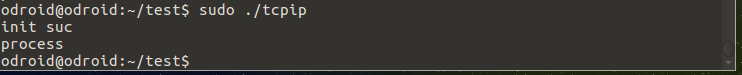
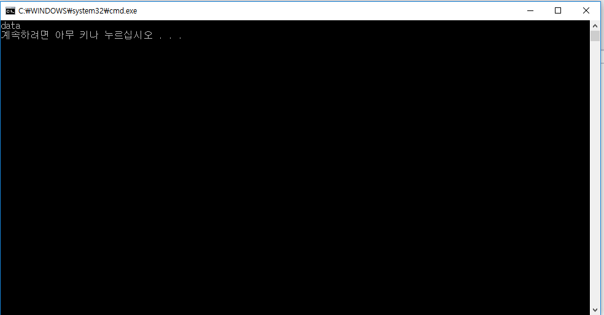

# Development_odroid - 20170804


## TCP/IP

 tcp/ip를 위한 코드는 클래스의 형태로 코딩을 하기로 했다. 

```
vim tcpip.hpp
```

<tcpip.hpp>

```c++
#include <stdlib.h>
#include <unistd.h>
#include <arpa/inet.h>
#include <sys/types.h>
#include <sys/socket.h>
#include <string>
#include <opencv2/opencv.hpp>

#define BUFF_SIZE 100

using namespace std;
using namespace cv;

class SERVER
{
private:
  	int server_socket;
  	int client_socket;
  	socklen_t client_addr_size;
  
  	struct sockaddr_in server_addr;
  	struct sockaddr_in client_addr;
  
  	string data; // for test
public:
  	SERVER();
  	~SERVER();
  	int init();
  	int connect();
  	int process();
  
}
```

<tcpip.cpp>

```c++
#include "tcpip.hpp"
#include <iostream>
#include <sstream>

SERVER::SERVER()
{
  
}

SERVER::~SERVER()
{
  
}

int SERVER::init()
{
  	server_socket = socket(PF_INET,SOCK_STREAM,0);
  	if(server_socket == -1)
  	{
      	cout << "server socket create failed"<<endl;
      	return -1;
  	}
  	memset(&server_addr,0,sizeof(server_addr));
  	server_addr.sin_family = AF_INET;
  	server_addr.sin_port = htons(4000);
  	server_addr.sin_addr.s_addr = htonl(INADDR_ANY);
  
  	if(bind(server_socket,(struct sockaddr*)&server_addr,sizeof(server_addr)) == -1)
    {
      	cout<<"bind error"<<endl;
      	return -1;
      
    }
  	if(listen(server_socket,5) == -1)
    {
      	cout << "listen error"<<endl;
      	return -1;
    }
  	return 0;
}

int SERVER::connect()
{
	client_addr_size = sizeof(client_addr);
  	client_socket = accept(server_socket,(struct sockaddr*)&client_addr,&client_addr_size);
  	if(client_socket == -1);
  	{
      	cout << " client connect failed "<< endl;
      	return -1;
  	}
  	return 0;
}

int SERVER::process()
{
  	data = "data";
  	write(client_socket,data.c_str(),data.length()+1);
  	close(client_socket);
}
```


server 코드는 init을 먼저 실행시켜 주고 connect와 process를 반복하면서 실행시키는 구조이다. 아직 여러 client들과의 통신은 안된다. 


```c++
#define WIN32_LEAN_AND_MEAN

#include <windows.h>
#include <winsock2.h>
#include <ws2tcpip.h>
#include <stdlib.h>
#include <stdio.h>


// Need to link with Ws2_32.lib, Mswsock.lib, and Advapi32.lib
#pragma comment (lib, "Ws2_32.lib")
#pragma comment (lib, "Mswsock.lib")
#pragma comment (lib, "AdvApi32.lib")


#define DEFAULT_BUFLEN 512
#define DEFAULT_PORT "4000"

int __cdecl main(int argc, char **argv)
{
	WSADATA wsaData;
	SOCKET ConnectSocket = INVALID_SOCKET;
	struct addrinfo *result = NULL,
		*ptr = NULL,
		hints;
	char *sendbuf = "1";
	char recvbuf[DEFAULT_BUFLEN];
	int iResult;
	int recvbuflen = DEFAULT_BUFLEN;


	// Initialize Winsock
	iResult = WSAStartup(MAKEWORD(2, 2), &wsaData);
	if (iResult != 0) {
		printf("WSAStartup failed with error: %d\n", iResult);
		return 1;
	}

	ZeroMemory(&hints, sizeof(hints));
	hints.ai_family = AF_UNSPEC;
	hints.ai_socktype = SOCK_STREAM;
	hints.ai_protocol = IPPROTO_TCP;

	// Resolve the server address and port
	iResult = getaddrinfo("141.223.198.71", DEFAULT_PORT, &hints, &result);
	if (iResult != 0) {
		printf("getaddrinfo failed with error: %d\n", iResult);
		WSACleanup();
		return 1;
	}

	// Attempt to connect to an address until one succeeds
	for (ptr = result; ptr != NULL; ptr = ptr->ai_next) {

		// Create a SOCKET for connecting to server
		ConnectSocket = socket(ptr->ai_family, ptr->ai_socktype,
			ptr->ai_protocol);
		if (ConnectSocket == INVALID_SOCKET) {
			printf("socket failed with error: %ld\n", WSAGetLastError());
			WSACleanup();
			return 1;
		}

		// Connect to server.
		iResult = connect(ConnectSocket, ptr->ai_addr, (int)ptr->ai_addrlen);
		if (iResult == SOCKET_ERROR) {
			closesocket(ConnectSocket);
			ConnectSocket = INVALID_SOCKET;
			continue;
		}
		break;
	}

	freeaddrinfo(result);

	if (ConnectSocket == INVALID_SOCKET) {
		printf("Unable to connect to server!\n");
		WSACleanup();
		return 1;
	}

	iResult = recv(ConnectSocket, recvbuf, recvbuflen, 0);

	printf("%s\n", recvbuf);
	// shutdown the connection since no more data will be sent
	iResult = shutdown(ConnectSocket, SD_SEND);
	if (iResult == SOCKET_ERROR) {
		printf("shutdown failed with error: %d\n", WSAGetLastError());
		closesocket(ConnectSocket);
		WSACleanup();
		return 1;
	}

	// cleanup
	closesocket(ConnectSocket);
	WSACleanup();

	return 0;
}
```

간단하게 winsock2 example을 변형하여서 char string의 형태로 tcpip server로 부터 데이터를 받는 코드를 작성하였다. 

"data"를 전송하며 tcpip에 간단한 테스트용 main을 만들어서 진행했다.





server init이 성공하면 init suc을 출력하고 accept를 실행하고 데이터를 전송한 후에는 process를 출력한다.

window 창에는 server에서 전송한 data라는 string이 출력되었다. 