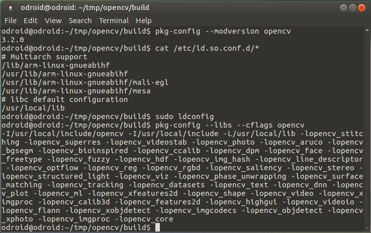
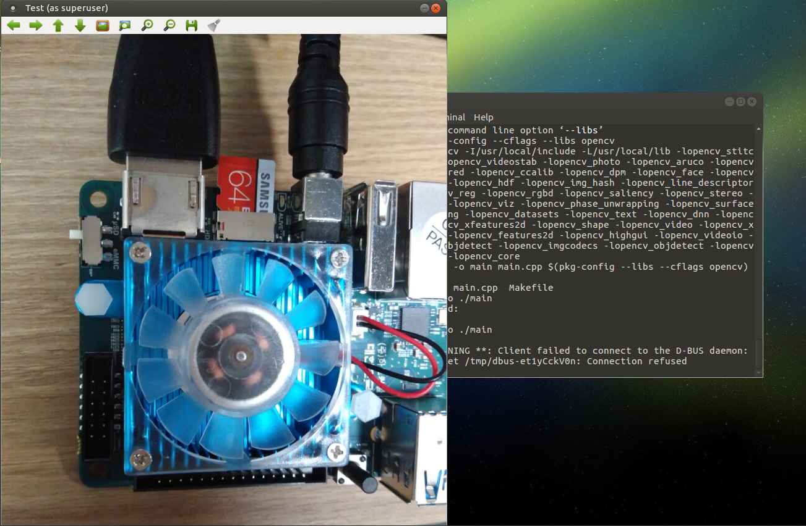

# Development_odroid - 20170703


## OPENCV Makefile & SDK

text editor geany install

```
sudo apt-get install geany
```


test용 directory를 만든다.

```
mkdir test
cd test
```


github로부터 test용 image를 하나 다운로드한다.

```
wget https://github.com/kysin960814/Development_odroid/raw/mster/Picture/20170628_SDset.jpg
```


```c++
#include <iostream>
#include <opencv2/opencv.hpp>
#include <opencv2/highgui.hpp>

using namespace std;
using namespace cv;

int main()
{
  		Mat image;
  		namedWindow("Test",CV_WINDOW_AUTOSIZE);
  		image = imread("20170628_SDset.jpg",CV_LOAD_IMAGE_COLOR);
  
  		if(image.empty())
        {
        	cout<<"image is empty"<<endl;
          	return 0;
        }
  		imshow("Test",image);
  		waitKey(0);
  		destroyWindow("Test");
  
  		return 0;
}
```


pkg-config setting

```
cd tmp/opencv/build
pkg-config --modversion opencv
```

3.2.0이 출력된다.

```
cat /etc/ld.so.conf.d/*
```

를 실행하면 

```
#Multiarch support
/lib/arm-linux-gnueabihf
/usr/lib/arm-linux-gnueabihf
/usr/lib/arm-linux-gnueabihf/mali-egl
/sur/lib/arm-linux-gnueabihf/mesa
#lib default configuration
/usr/local/lib
```

`/usr/local/lib`이 없으면 `sudo echo '/usr/local/lib'> /etc/ld.so.conf.d/opencv.conf`

있으면

`sudo ldconfig`


`plg-config --libs --cflags opencv`를 실행하면 아래 사진과 같이 출력되면 성공이다.



다시 테스트를 위해서

```
cd 
cd test
g++ -o main main.cpp $(pkg-config --libs --cflags opencv)
sudo ./main
```

아래 그림은 실행 결과이다.




